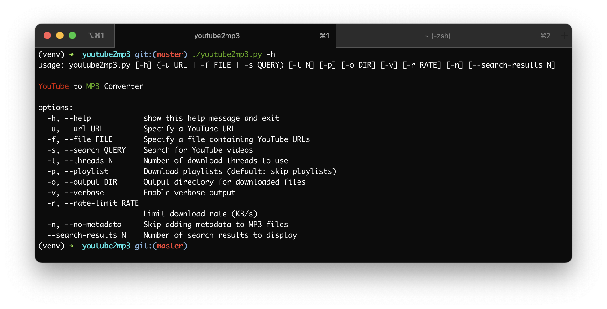

# youtube2mp3  

**youtube2mp3.py**: A very simple and minimal, __multi-threaded__ youtube to mp3 converter using [youtube-dl](https://github.com/rg3/youtube-dl).

As input can be either a single youtube-url or a file that contains youtube-urls (*the file does not need to have a specific format - youtube urls are detected automatically*).

**Requirements:**
*   ffmpeg
*   [youtube-dl](https://github.com/rg3/youtube-dl#installation)
*   [colorama](https://pypi.python.org/pypi/colorama)
*   [validators](https://pypi.python.org/pypi/validators/)

**Note:** To install requirements (except for _ffmpeg_) you can do: 
`pip install -r requirements.txt --upgrade --user`

## License

This project is licensed under the MIT License - see the [LICENSE](LICENSE) file for details